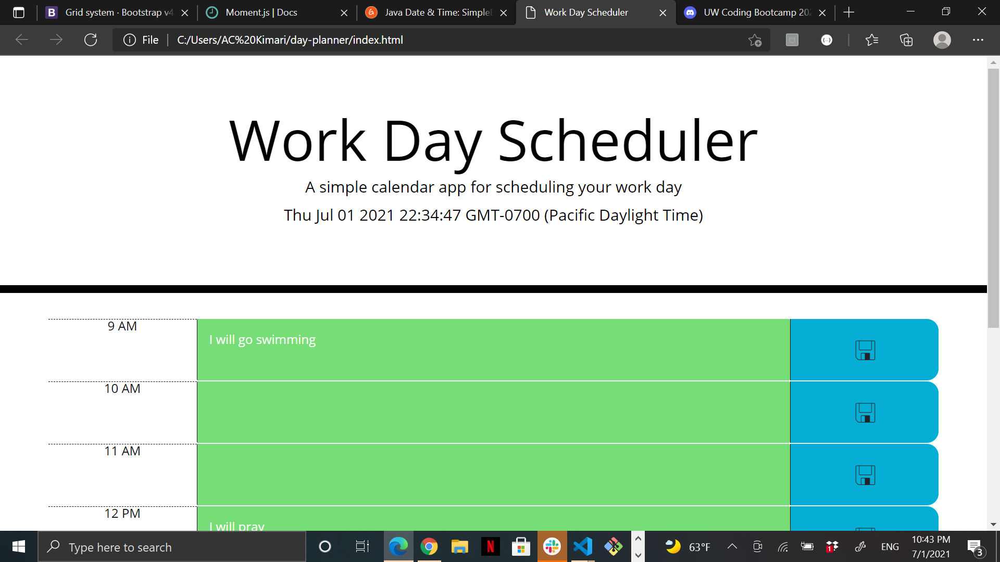
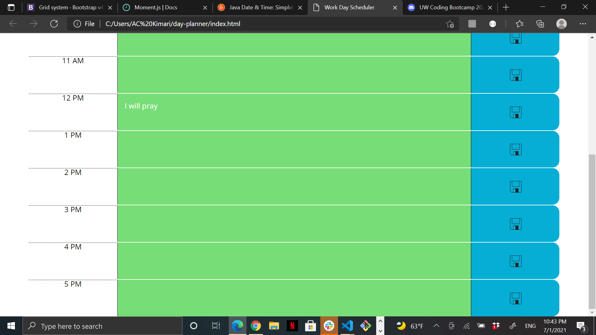
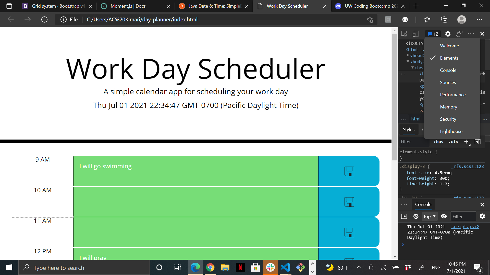

# Day Planner

## Description

This project was based off of scheduling in daily activities via a day planner. It was indeed a fum project and challenging. My top motivator was being able to utilize recent class teachings in my codes.

Furthermore, I built this project to create a platform that would allow people to schedule their daily activites with ease and have it saved. I may have not accomplished all tasks but I definitely believe I tackled the majority. I unfortunately had a problem accessing my Local Storage on my website and couldn't see whether I successfully stored my data. Additionally, I also struggled with the time frames and was not able to input the time as requested.

However, I learned a lot in this project such as how to build rows and column using html and JQuery attributes. 

Finally, I belive my project would stand out via my use of a unique save button and use of html to build rows and column instead of JavaScript (however, this might have made it more complicated).
## Illustration

Step 1: Use JavaScript to set date and time on the page header.

Step 2: Create rows and column using either HTML or JavaScript. Use CSS classes as your guide.

Step 3: Set Time from 9AM to 5PM and set the properties required for time.

Step 4: Color code your day planner to change color according to time (pas, present, future).

Step 5: Ensure user can input an event and save it with a save button.

Step 6: Create local storage for text input when saved by user to avoid loosing data.

Step 7: When page is refreshed ensure the events put in don't refresh.
## Usage

